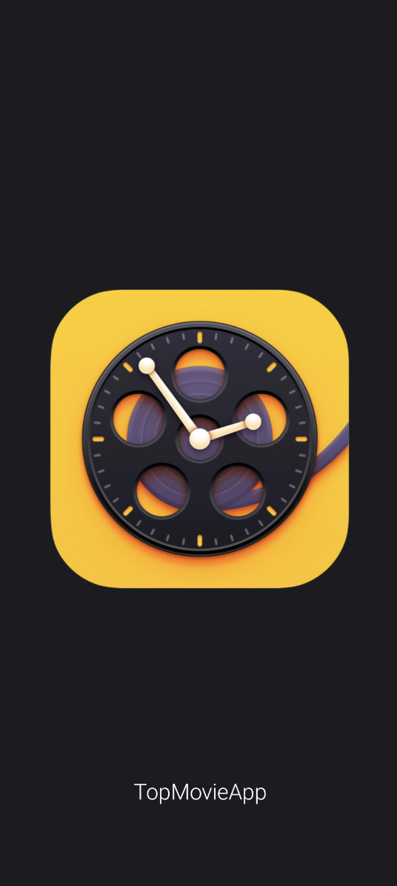
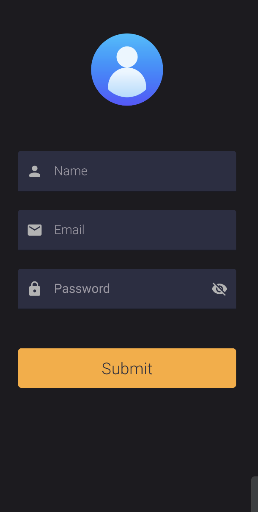
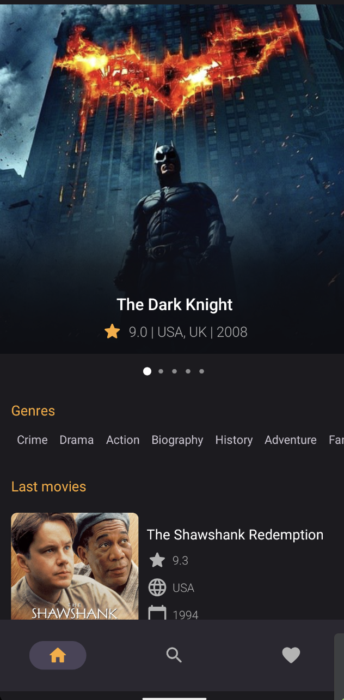
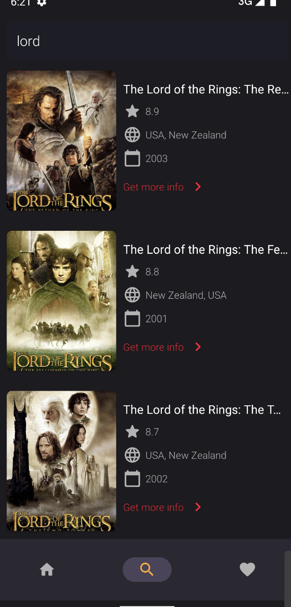
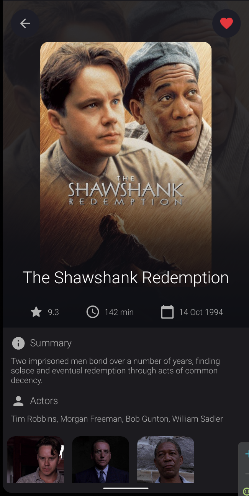
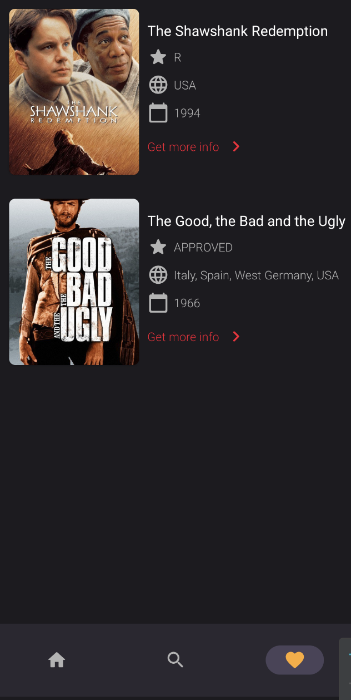

# Movie-App

Movie-App is an Android movie browsing app built with Kotlin, XML layouts, ViewBinding, Retrofit, Room, and an MVVM-style structure. It uses [moviesapi.ir](https://moviesapi.ir/) to fetch movie data, genres, search results, registration responses, and movie details.

## Screenshots

<p align="center">
  
  
  
</p>

<p align="center">
  
  
  
</p>

## Features

- Splash screen with delayed navigation.
- Register screen connected to the remote register endpoint.
- Bottom navigation with Home, Search, and Favorite sections.
- Home screen with top movies, genres, and latest movies.
- Horizontal top-movies carousel with snap helper and circle indicator.
- Genre list loaded from the API.
- Latest movies list with detail navigation.
- Movie search by text query.
- Empty-state and loading-state UI handling.
- Movie detail screen with poster, rating, runtime, release date, plot, actors, and image gallery.
- Favorite/unfavorite support on the detail page.
- Local favorite movies storage with Room.
- DataStore helper for saving a user token value.
- Coil image loading and Retrofit/Gson networking.

## Tech Stack

- Kotlin
- Android XML layouts
- ViewBinding
- MVVM-style ViewModels and repositories
- Retrofit and Gson
- OkHttp logging interceptor
- Room database
- DataStore Preferences
- Kotlin Coroutines
- LiveData
- Coil
- Material Components
- Navigation dependencies
- CircleIndicator

## Project Structure

```text
MovieApp/app/src/main/java/com/alirahimi/movieapp
├── api                 # Retrofit API service for moviesapi.ir
├── db                  # Room entity, DAO, and database for favorites
├── di                  # Manual app module for API, database, DAO, repositories, and shared objects
├── models              # Register, home, and detail API response models
├── repository          # Data-access layer for register, home, search, detail, and favorite flows
├── ui
│   ├── splash          # SplashActivity
│   ├── register        # RegisterActivity and register body helper
│   ├── home            # HomeFragment and adapters
│   ├── search          # SearchFragment
│   ├── favorite        # FavoriteFragment and adapter
│   └── detail          # DetailActivity and image adapter
├── utils               # Constants, Application class, extensions, and DataStore helper
├── viewmodel           # ViewModels and factories
└── MainActivity.kt     # Bottom navigation host activity
```

## API Endpoints Used

- `POST v1/register`
- `GET v1/genres`
- `GET v1/genres/{genre_id}/movies`
- `GET v1/movies`
- `GET v1/movies?q={name}`
- `GET v1/movies/{movie_id}`

The API base URL is configured in `Constants.kt`.

## Local Database

Favorites are stored in Room using `MovieEntity`, `MovieDao`, and `MoviesDatabase`. The app can insert, delete, list, and check the existence of favorite movies.

## Getting Started

1. Clone the repository.
2. Open the `MovieApp` folder in Android Studio.
3. Sync Gradle.
4. Run the `app` configuration on an Android device or emulator.

## Build

```bash
cd MovieApp
./gradlew assembleDebug
```

## Notes

This project is a learning/portfolio movie app. It depends on the availability of `moviesapi.ir` and does not include a custom backend, offline sync, pagination persistence, or production authentication handling.
